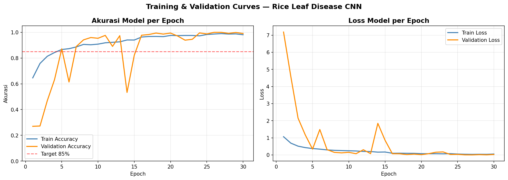
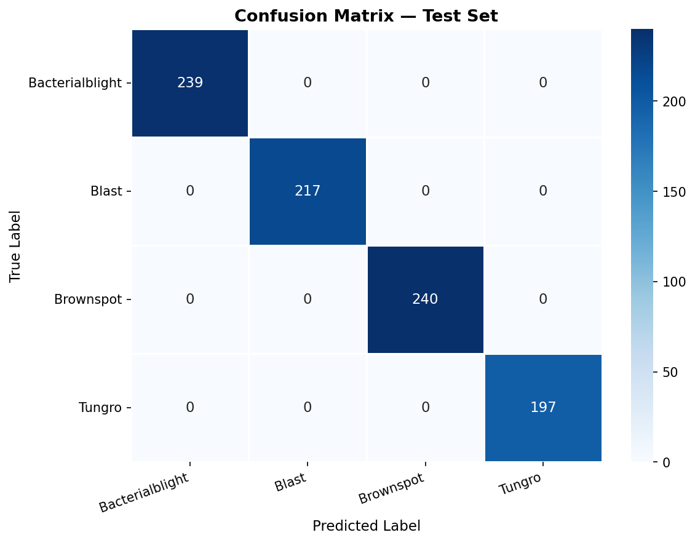

# 🌾 Proyek Klasifikasi Gambar: Rice Leaf Disease Classification

Proyek ini merupakan submission akhir kelas **Machine Learning** pada platform Dicoding. Model CNN dibangun untuk mengklasifikasikan 4 jenis penyakit daun padi menggunakan TensorFlow/Keras.

---

## 👤 Identitas

| | |
|---|---|
| **Nama** | Rifqi Zaghlul Musyaffa |
| **Email** | rifqizaghlul1@gmail.com|
| **ID Dicoding** | jaglul |

---

## 📂 Struktur Direktori Submission

```
submission/
├── saved_model/
│   ├── saved_model.pb
│   └── variables/
├── tfjs_model/
│   ├── model.json
│   └── group1-shard1of1.bin
├── tflite/
│   ├── model.tflite
│   └── label.txt
├── notebook.ipynb
├── README.md
└── requirements.txt
```

---

## 📊 Dataset

- **Nama Dataset** : Rice Leaf Disease Image Samples
- **Sumber** : Kaggle — Prabira Kumar Sethy (2020)
- **Total Gambar** : 5.932 gambar
- **Format** : JPEG
- **Jumlah Kelas** : 4 kelas

| Kelas | Deskripsi |
|---|---|
| Bacterialblight | Hawar daun bakteri |
| Blast | Blas padi |
| Brownspot | Bercak coklat |
| Tungro | Tungro |

### Pembagian Dataset

Dataset tidak memiliki split bawaan sehingga dilakukan split manual secara stratified per kelas dengan rasio:

| Split | Rasio |
|---|---|
| Train | 70% |
| Validation | 15% |
| Test | 15% |

---

## 🧠 Arsitektur Model

Model dibangun menggunakan **Sequential API** Keras dengan arsitektur CNN sebagai berikut:

- **4 blok konvolusi** masing-masing terdiri dari: `Conv2D → BatchNormalization → Conv2D → BatchNormalization → MaxPooling2D → Dropout`
- **Filter**: 32 → 64 → 128 → 256
- **Classifier head**: `Flatten → Dense(512) → Dense(256) → Dense(4, softmax)`
- **Input size**: 224 × 224 × 3
- **Optimizer**: Adam (lr=1e-3)
- **Loss**: Categorical Crossentropy

### Callbacks yang Digunakan

| Callback | Konfigurasi |
|---|---|
| EarlyStopping | monitor=val_accuracy, patience=8 |
| ModelCheckpoint | save best only |
| ReduceLROnPlateau | monitor=val_loss, patience=4, factor=0.5 |

### Augmentasi Data

Augmentasi diterapkan **hanya pada data training** karena dataset relatif kecil (~5.932 gambar):

- Rotation (±30°)
- Width & Height Shift (±15%)
- Horizontal & Vertical Flip
- Zoom (±15%)
- Shear (±10%)
- Brightness adjustment (0.8–1.2)

---

## 📈 Hasil Evaluasi

| Metrik | Train | Validation | Test |
|---|---|---|---|
| **Accuracy** | ~99% | ~99% | **100%** |
| **Loss** | ~0.01 | ~0.03 | ~0.00 |

### Training Curves



### Confusion Matrix



Semua 893 gambar test berhasil diklasifikasikan dengan benar:

| Kelas | Benar | Salah |
|---|---|---|
| Bacterialblight | 239 | 0 |
| Blast | 217 | 0 |
| Brownspot | 240 | 0 |
| Tungro | 197 | 0 |

---

## 🔄 Format Model yang Disimpan

| Format | Kegunaan |
|---|---|
| **SavedModel** | Deployment server / cloud |
| **TF-Lite** | Perangkat mobile & embedded |
| **TF.js** | Aplikasi berbasis browser |

---

## ⚙️ Cara Menjalankan

1. Upload folder dataset ke Google Drive dengan struktur:
   ```
   rice-leaf-disease/
   ├── Bacterialblight/
   ├── Blast/
   ├── Brownspot/
   └── Tungro/
   ```

2. Buka `notebook.ipynb` di Google Colab

3. Sesuaikan path dataset:
   ```python
   DATASET_DIR = Path('/content/drive/MyDrive/rice-leaf-disease')
   ```

4. Jalankan semua sel secara berurutan

5. Install dependensi:
   ```bash
   pip install -r requirements.txt
   ```

---

## 📦 Dependencies

Lihat `requirements.txt` untuk daftar lengkap. Library utama:

- TensorFlow >= 2.13.0
- NumPy
- Matplotlib
- Seaborn
- Scikit-learn
- Pillow
